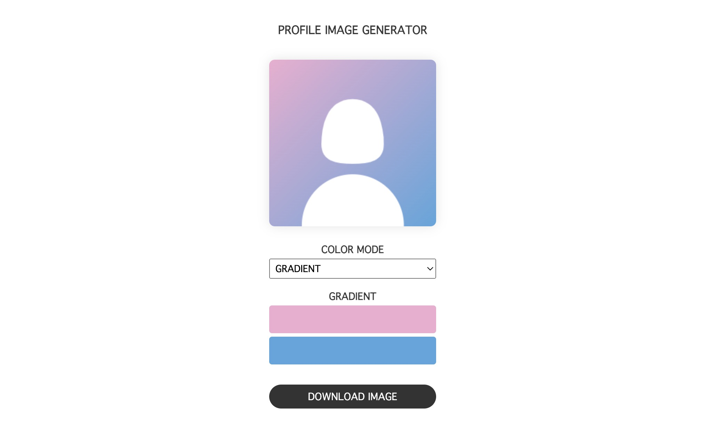

<h3>GENERATE YOUR PROFILE IMAGE</h3>

# 📖 PROFILE IMAGE GENERATOR

You can generate simple profile image and download.

## 🚀 Live Demo

https://pss-aileen.github.io/project-profile-image-generator/

## 🛠 Built With

- Canvas API

## 📕 Usage

1. Choose color you like
2. Download Image

## 🔭 Future Features
- [ ] change output image size

